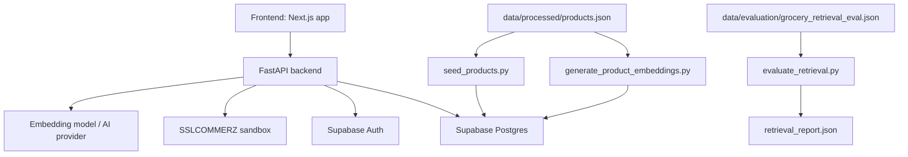
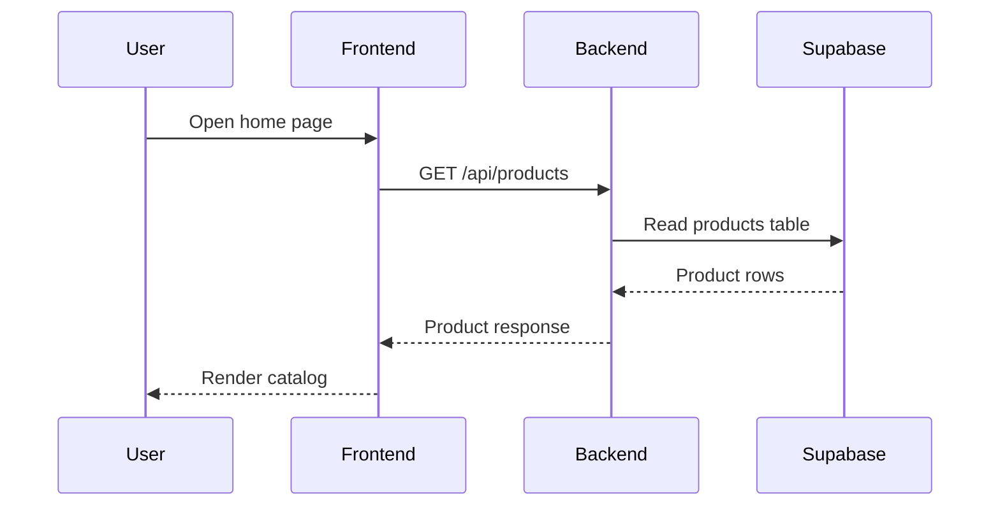
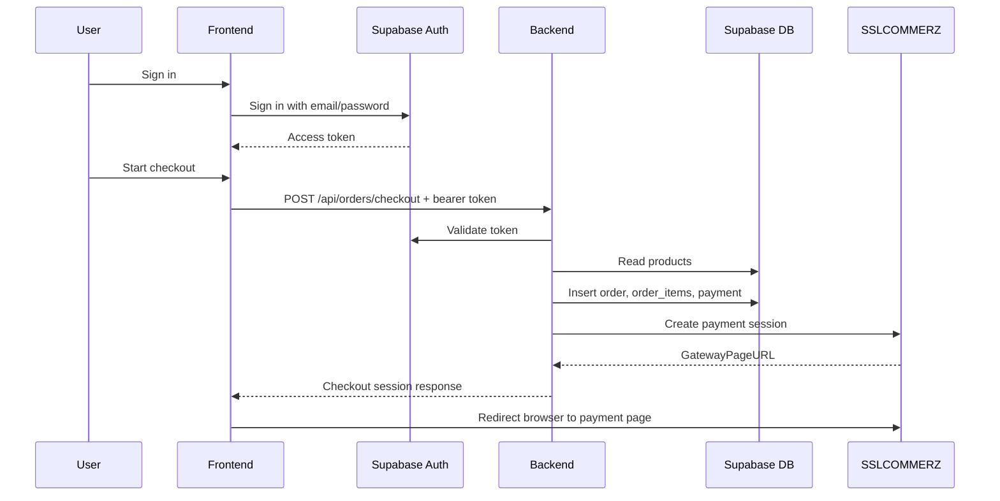
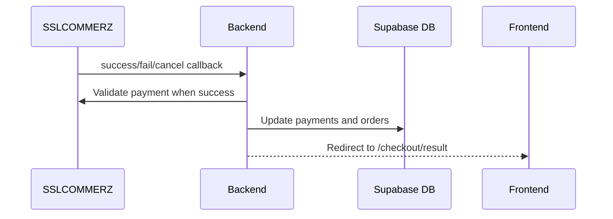
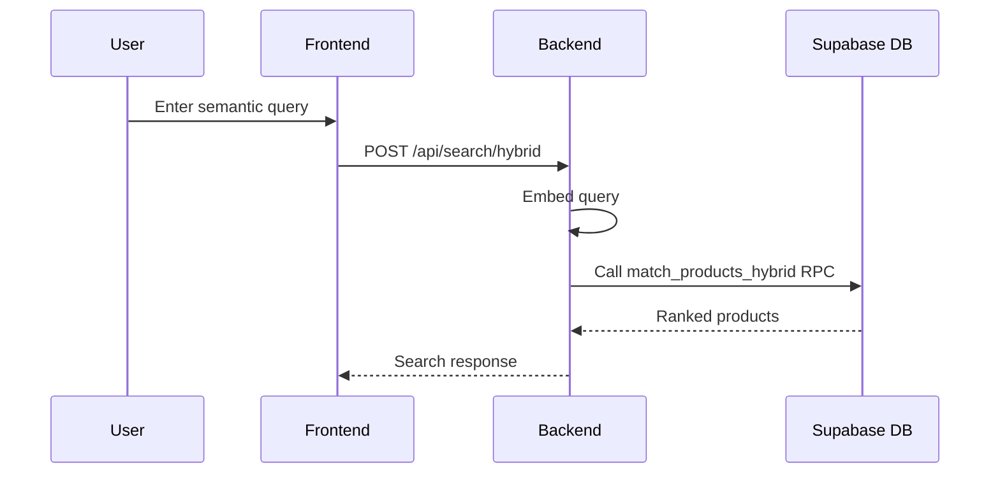

# Architecture

## Purpose

This document describes the current architecture of the AI-enabled grocery e-commerce project.

It focuses on:

- system structure
- component responsibilities
- data flow
- authentication flow
- checkout and payment flow
- semantic retrieval and AI flow
- current architectural limitations

This document describes the implemented system only. It does not describe planned features unless they already appear in the repository as code, schema, or deployment configuration.

## 1. System Overview

The application is organized as a three-layer system:

1. a Next.js frontend in `frontend/`
2. a FastAPI backend in `backend/`
3. a Supabase-backed data layer for authentication, catalog data, orders, payments, and embeddings

The project also includes:

- SQL migrations for the database schema in `backend/migrations/`
- scripts for seeding products and generating embeddings in `backend/scripts/`
- processed dataset and evaluation artifacts in `data/`

At runtime, the main user-facing flow is:

1. the frontend loads product data from the backend
2. the user browses products, signs in, and builds a cart
3. the frontend sends authenticated checkout requests to the backend
4. the backend creates orders and payment records in Supabase
5. the backend redirects the user to SSLCOMMERZ sandbox checkout
6. payment callbacks update payment and order status
7. AI and semantic search features use the same product catalog as the commerce flow

## 2. High-Level Architecture

## 3. Repository-Level Architecture

### 3.1 Frontend

The frontend is implemented in `frontend/` using Next.js 16, React 19, TypeScript, and Tailwind CSS.

Relevant files:

- [frontend/src/app/layout.tsx](/D:/humayra/ai-enabled-ecommerce/frontend/src/app/layout.tsx)
- [frontend/src/app/page.tsx](/D:/humayra/ai-enabled-ecommerce/frontend/src/app/page.tsx)
- [frontend/src/app/products/[productId]/page.tsx](/D:/humayra/ai-enabled-ecommerce/frontend/src/app/products/[productId]/page.tsx)
- [frontend/src/app/checkout/result/page.tsx](/D:/humayra/ai-enabled-ecommerce/frontend/src/app/checkout/result/page.tsx)
- [frontend/src/lib/api.ts](/D:/humayra/ai-enabled-ecommerce/frontend/src/lib/api.ts)
- [frontend/src/lib/supabase/client.ts](/D:/humayra/ai-enabled-ecommerce/frontend/src/lib/supabase/client.ts)

The frontend is responsible for:

- rendering the catalog and product detail pages
- holding cart state in the browser
- handling Supabase sign-in and sign-up
- calling backend APIs for checkout, orders, search, and AI features
- rendering AI recommendations and cart actions

### 3.2 Backend

The backend is implemented in `backend/app/` using FastAPI.

Relevant files:

- [backend/app/main.py](/D:/humayra/ai-enabled-ecommerce/backend/app/main.py)
- [backend/app/api/products.py](/D:/humayra/ai-enabled-ecommerce/backend/app/api/products.py)
- [backend/app/api/orders.py](/D:/humayra/ai-enabled-ecommerce/backend/app/api/orders.py)
- [backend/app/api/payments.py](/D:/humayra/ai-enabled-ecommerce/backend/app/api/payments.py)
- [backend/app/api/ai.py](/D:/humayra/ai-enabled-ecommerce/backend/app/api/ai.py)
- [backend/app/api/search.py](/D:/humayra/ai-enabled-ecommerce/backend/app/api/search.py)
- [backend/app/api/dependencies.py](/D:/humayra/ai-enabled-ecommerce/backend/app/api/dependencies.py)

The backend is responsible for:

- exposing REST API endpoints
- validating authenticated users for protected order routes
- loading products from Supabase or local processed data
- repricing checkout items from the database
- creating orders and payment records
- starting SSLCOMMERZ payment sessions
- verifying payment callbacks
- serving AI and semantic search responses

### 3.3 Data Layer

The data layer consists of:

- processed catalog data in `data/processed/products.json`
- Supabase tables defined by SQL migrations
- product embeddings stored in `product_embeddings`
- evaluation inputs and reports under `data/evaluation/`

Relevant files:

- [backend/migrations/0001_initial_schema.sql](/D:/humayra/ai-enabled-ecommerce/backend/migrations/0001_initial_schema.sql)
- [backend/migrations/0002_checkout_schema_compatibility.sql](/D:/humayra/ai-enabled-ecommerce/backend/migrations/0002_checkout_schema_compatibility.sql)
- [backend/migrations/0003_semantic_retrieval.sql](/D:/humayra/ai-enabled-ecommerce/backend/migrations/0003_semantic_retrieval.sql)
- [data/processed/products.json](/D:/humayra/ai-enabled-ecommerce/data/processed/products.json)
- [data/processed/data_quality_report.json](/D:/humayra/ai-enabled-ecommerce/data/processed/data_quality_report.json)
- [data/evaluation/grocery_retrieval_eval.json](/D:/humayra/ai-enabled-ecommerce/data/evaluation/grocery_retrieval_eval.json)
- [data/evaluation/retrieval_report.json](/D:/humayra/ai-enabled-ecommerce/data/evaluation/retrieval_report.json)

## 4. Frontend Architecture

## 4.1 Application Shell

The root layout in [frontend/src/app/layout.tsx](/D:/humayra/ai-enabled-ecommerce/frontend/src/app/layout.tsx) wraps the application with `CartProvider`.

This means cart state is available across the frontend tree through React context.

## 4.2 Page Structure

The current main pages are:

- `/` for the catalog, auth panel, order history, and cart panel
- `/products/[productId]` for product detail
- `/checkout/result` for payment result handling

The home page in [frontend/src/app/page.tsx](/D:/humayra/ai-enabled-ecommerce/frontend/src/app/page.tsx):

- loads products on the server using `getProducts()`
- renders `AuthPanel`
- renders `OrderHistory`
- renders `ProductCatalog`
- renders `CartPanel`

## 4.3 Cart State

Cart state is managed in [frontend/src/components/CartProvider.tsx](/D:/humayra/ai-enabled-ecommerce/frontend/src/components/CartProvider.tsx).

Current behavior:

- cart items are stored in client-side React state
- cart contents are persisted in `window.localStorage`
- the cart is restored on page load
- the provider exposes add, remove, increase, decrease, and clear operations

This design keeps cart behavior simple and responsive, but it also means the cart is currently browser-local until checkout is submitted.

## 4.4 Authentication

Authentication is handled in the frontend with Supabase browser auth.

Relevant files:

- [frontend/src/components/AuthPanel.tsx](/D:/humayra/ai-enabled-ecommerce/frontend/src/components/AuthPanel.tsx)
- [frontend/src/lib/supabase/client.ts](/D:/humayra/ai-enabled-ecommerce/frontend/src/lib/supabase/client.ts)

The frontend:

- creates a browser Supabase client
- supports sign-up with email and password
- supports sign-in with email and password
- listens for auth state changes
- refreshes access tokens when needed before checkout

The backend does not create sessions for the user. Instead, the frontend receives the access token from Supabase and sends it to protected backend endpoints as a bearer token.

## 4.5 Frontend API Layer

The frontend uses [frontend/src/lib/api.ts](/D:/humayra/ai-enabled-ecommerce/frontend/src/lib/api.ts) as a shared client for backend requests.

This module defines:

- product fetch methods
- checkout request methods
- order history methods
- semantic search requests
- AI feature requests
- chat requests
- provider status requests

This keeps request logic separate from React components and centralizes request timeouts and error handling.

## 4.6 Catalog and AI UI Components

The catalog page composes multiple user-facing features inside [frontend/src/components/ProductCatalog.tsx](/D:/humayra/ai-enabled-ecommerce/frontend/src/components/ProductCatalog.tsx).

It currently includes:

- client-side text search
- client-side category filtering
- product cards with add-to-cart actions
- `NaturalLanguageFinder`
- `BundlePlanner`
- `Chatbot`

The chat UI in [frontend/src/components/Chatbot.tsx](/D:/humayra/ai-enabled-ecommerce/frontend/src/components/Chatbot.tsx):

- sends user messages to `/api/ai/chat`
- includes current cart items in the request
- displays assistant messages, grounded product results, and cart actions
- can apply non-confirmation cart actions immediately
- shows whether a configured AI provider is ready

## 5. Backend Architecture

## 5.1 FastAPI Application Composition

The backend entry point is [backend/app/main.py](/D:/humayra/ai-enabled-ecommerce/backend/app/main.py).

The application:

- creates a FastAPI app titled `AI Grocery Commerce API`
- configures CORS using environment settings
- registers routers for products, orders, payments, AI, and search
- exposes `GET /api/health`

## 5.2 API Layer

The API layer is organized by feature.

### Product APIs

[backend/app/api/products.py](/D:/humayra/ai-enabled-ecommerce/backend/app/api/products.py) provides:

- `GET /api/products`
- `GET /api/products/{product_id}`
- `GET /api/products/tags`

The current list endpoint supports:

- optional text search
- optional exact category filtering

Product loading is delegated to `product_service`.

### Order APIs

[backend/app/api/orders.py](/D:/humayra/ai-enabled-ecommerce/backend/app/api/orders.py) provides:

- `GET /api/orders/me`
- `GET /api/orders/{order_id}`
- `POST /api/orders/checkout`

These routes depend on `require_current_user`, which validates a bearer token with Supabase and returns the authenticated user identity.

### Payment APIs

[backend/app/api/payments.py](/D:/humayra/ai-enabled-ecommerce/backend/app/api/payments.py) provides callback endpoints for SSLCOMMERZ:

- `/api/payments/sslcommerz/success`
- `/api/payments/sslcommerz/fail`
- `/api/payments/sslcommerz/cancel`

These routes read callback parameters, update backend state through `payment_service`, and redirect the user back to the frontend result page.

### AI APIs

[backend/app/api/ai.py](/D:/humayra/ai-enabled-ecommerce/backend/app/api/ai.py) provides:

- `/api/ai/product-finder`
- `/api/ai/bundle-planner`
- `/api/ai/cart-optimizer`
- `/api/ai/chat`
- `/api/ai/provider-status`

These endpoints use dedicated service functions or the chat agent.

### Search API

[backend/app/api/search.py](/D:/humayra/ai-enabled-ecommerce/backend/app/api/search.py) provides:

- `POST /api/search/hybrid`

This endpoint exposes the semantic retrieval path separately from the higher-level AI workflows.

## 5.3 Service Layer

The backend service layer contains the main business logic.

Important services include:

- [backend/app/services/product_service.py](/D:/humayra/ai-enabled-ecommerce/backend/app/services/product_service.py)
- [backend/app/services/order_service.py](/D:/humayra/ai-enabled-ecommerce/backend/app/services/order_service.py)
- [backend/app/services/payment_service.py](/D:/humayra/ai-enabled-ecommerce/backend/app/services/payment_service.py)
- [backend/app/services/hybrid_search_service.py](/D:/humayra/ai-enabled-ecommerce/backend/app/services/hybrid_search_service.py)
- [backend/app/services/embedding_service.py](/D:/humayra/ai-enabled-ecommerce/backend/app/services/embedding_service.py)
- [backend/app/services/product_finder_service.py](/D:/humayra/ai-enabled-ecommerce/backend/app/services/product_finder_service.py)
- [backend/app/services/bundle_planner_service.py](/D:/humayra/ai-enabled-ecommerce/backend/app/services/bundle_planner_service.py)
- [backend/app/services/cart_optimizer_service.py](/D:/humayra/ai-enabled-ecommerce/backend/app/services/cart_optimizer_service.py)

The service layer separates API routing from:

- data access
- checkout repricing
- payment initiation
- embedding creation
- semantic retrieval
- AI feature logic

## 5.4 Product Loading Strategy

The product loader in [backend/app/services/product_service.py](/D:/humayra/ai-enabled-ecommerce/backend/app/services/product_service.py) has two modes:

1. primary mode: read product records from Supabase
2. fallback mode: read `data/processed/products.json` from local disk

This fallback is implemented for both:

- `load_products()`
- `get_product_by_id()`

Architecturally, this means the product catalog can still render when the database query fails, as long as the processed file exists in the deployment or local environment.

## 6. Data Architecture

## 6.1 Main Tables

The core schema is defined in [backend/migrations/0001_initial_schema.sql](/D:/humayra/ai-enabled-ecommerce/backend/migrations/0001_initial_schema.sql).

The main tables are:

- `products`
- `product_embeddings`
- `profiles`
- `carts`
- `cart_items`
- `orders`
- `order_items`
- `payments`
- `ai_interactions`

### Products

The `products` table stores:

- product identity fields such as `id`, `source_id`, and `slug`
- display fields such as `name`, `brand`, `category`, and `unit`
- pricing fields such as `price` and `old_price`
- source fields such as `image_url`, `product_url`, and `scraped_at`
- enrichment fields such as `normalized_category`, `product_type`, and `tags`

### Product Embeddings

The `product_embeddings` table stores:

- one row per product
- a content hash
- the embedding model name
- vector data used for retrieval

Migration `0003_semantic_retrieval.sql` adds a 384-dimensional `embedding_384` column and an HNSW index for cosine similarity search.

### Orders and Payments

The commerce flow uses:

- `orders` for checkout-level records
- `order_items` for item snapshots
- `payments` for provider payment state

The schema includes:

- order status values such as `pending_payment`, `paid`, `confirmed`, and `cancelled`
- payment status values such as `created`, `requires_payment`, `succeeded`, `failed`, and `cancelled`
- an `idempotency_key` on `orders`

### AI Interactions

The `ai_interactions` table exists in the schema for storing metadata about AI requests and responses. The table is defined in SQL, but the currently reviewed application code does not show a repository-wide persistence flow for every AI endpoint.

## 6.2 Row-Level Security

Row-level security is enabled on the major tables in `0001_initial_schema.sql`.

Current policies include:

- public read access for `products`
- self-read and self-update for `profiles`
- self-owned access for `carts` and `cart_items`
- self-read access for `orders`, `order_items`, and `payments`
- self-read access for `ai_interactions`

This design matches the backend route structure, where order access is restricted to the authenticated user.

## 6.3 Data Initialization and Indexing

The project uses scripts in `backend/scripts/` for catalog initialization.

### Product Seeding

[backend/scripts/seed_products.py](/D:/humayra/ai-enabled-ecommerce/backend/scripts/seed_products.py):

- reads `data/processed/products.json`
- upserts product rows into Supabase in batches

### Embedding Generation

[backend/scripts/generate_product_embeddings.py](/D:/humayra/ai-enabled-ecommerce/backend/scripts/generate_product_embeddings.py):

- reads processed products
- enriches them with tags and normalized fields
- creates embedding documents using `embedding_service.product_document`
- generates embeddings in batches
- stores vectors in `product_embeddings`

### Retrieval Evaluation

[backend/scripts/evaluate_retrieval.py](/D:/humayra/ai-enabled-ecommerce/backend/scripts/evaluate_retrieval.py):

- reads evaluation queries from `data/evaluation/grocery_retrieval_eval.json`
- runs hybrid search for each query
- calculates recall@5 and MRR@5
- writes the results to `data/evaluation/retrieval_report.json`

## 7. Authentication Architecture

The authentication flow is split between frontend and backend.

### Frontend Side

The frontend:

- signs users up and in with Supabase Auth
- stores session state through the Supabase client
- refreshes tokens before authenticated API calls

### Backend Side

The backend authentication dependency is [backend/app/api/dependencies.py](/D:/humayra/ai-enabled-ecommerce/backend/app/api/dependencies.py).

It:

- expects a bearer token
- calls `get_supabase().auth.get_user(token)`
- rejects missing, invalid, or expired tokens
- returns a `CurrentUser` object with `id` and `email`

This means the backend does not trust a user ID supplied in the request body for order access. It derives the user identity from the validated Supabase token.

## 8. Checkout and Payment Architecture

## 8.1 Checkout Flow

The checkout flow starts in [frontend/src/components/CartPanel.tsx](/D:/humayra/ai-enabled-ecommerce/frontend/src/components/CartPanel.tsx).

The frontend:

- collects delivery name, phone, and address
- reads the cart from local state
- ensures the user is signed in
- sends `customer_name`, `customer_phone`, `customer_address`, `items`, and `idempotency_key`
- calls `POST /api/orders/checkout`

The backend checkout logic is implemented in [backend/app/services/order_service.py](/D:/humayra/ai-enabled-ecommerce/backend/app/services/order_service.py).

The backend:

1. checks whether the same `idempotency_key` already exists for the user
2. loads requested products from the database
3. rejects missing products
4. rejects products marked `out_of_stock`
5. recalculates subtotal from database prices
6. inserts the `orders` record
7. inserts `order_items`
8. inserts an initial `payments` row with status `created`

This is an important part of the architecture because price and stock are revalidated on the server before payment is started.

## 8.2 Payment Session Creation

The payment integration is implemented in [backend/app/services/payment_service.py](/D:/humayra/ai-enabled-ecommerce/backend/app/services/payment_service.py).

When checkout starts:

- the backend creates a transaction ID from the order ID
- it calls the SSLCOMMERZ session API
- it supplies success, fail, and cancel callback URLs
- it stores the provider transaction ID in the `payments` table
- it returns `GatewayPageURL` to the frontend

The frontend then redirects the browser to that payment URL.

## 8.3 Payment Verification

When SSLCOMMERZ returns to the backend:

- `/success` validates the payment using `val_id`
- the backend checks payment status
- it verifies amount and currency against stored payment data
- it updates `payments.status` to `succeeded`
- it updates `orders.status` to `paid`

For failure or cancellation:

- the payment row is updated
- the order is set to `payment_failed` or `cancelled`

The callback handler then redirects the user back to the frontend checkout result page with query parameters.

## 9. Semantic Retrieval Architecture

## 9.1 Embedding Construction

Embedding behavior is implemented in [backend/app/services/embedding_service.py](/D:/humayra/ai-enabled-ecommerce/backend/app/services/embedding_service.py).

The canonical embedding document for a product is built from:

- product name
- brand
- normalized category or category
- category
- product type
- unit
- tags

The current embedding constants are:

- model name: `sentence-transformers/all-MiniLM-L6-v2`
- embedding dimension: `384`

## 9.2 Retrieval Function

The database retrieval path is defined in [backend/migrations/0003_semantic_retrieval.sql](/D:/humayra/ai-enabled-ecommerce/backend/migrations/0003_semantic_retrieval.sql).

The SQL function `match_products_hybrid(...)`:

- receives a query embedding
- optionally filters by category
- optionally filters by minimum and maximum price
- computes cosine similarity using `embedding_384`
- returns product fields and a semantic score

The backend wrapper is [backend/app/services/hybrid_search_service.py](/D:/humayra/ai-enabled-ecommerce/backend/app/services/hybrid_search_service.py).

It:

- extracts or infers a max price from phrases like `under 500 taka`
- embeds the user query
- calls the Supabase RPC function
- returns structured matches

If the retrieval RPC is unavailable, the service returns an HTTP 503 error indicating that the embedding index is not ready.

## 10. AI Architecture

## 10.1 Task-Specific AI Endpoints

Three AI-oriented task endpoints are exposed in [backend/app/api/ai.py](/D:/humayra/ai-enabled-ecommerce/backend/app/api/ai.py):

- `product-finder`
- `bundle-planner`
- `cart-optimizer`

These endpoints delegate to dedicated service functions rather than using a single general-purpose assistant for every request.

This separates:

- semantic product finding
- bundle planning
- cart analysis

from the more conversational chat route.

## 10.2 Chat Agent Architecture

The chat behavior is implemented in [backend/app/ai/agent.py](/D:/humayra/ai-enabled-ecommerce/backend/app/ai/agent.py) and [backend/app/ai/tools.py](/D:/humayra/ai-enabled-ecommerce/backend/app/ai/tools.py).

The current design is a hybrid agent pattern:

1. detect likely user intent with rule-based logic
2. call one or more grounded catalog or cart tools
3. optionally synthesize a better natural-language response through an LLM
4. return structured products, citations, and cart actions

Implemented tool behaviors include:

- catalog product search
- price comparison
- bundle planning
- cart optimization
- cart add, remove, clear, and quantity actions

The chat system supports two output modes:

- deterministic fallback mode when no LLM client is available
- LLM synthesis mode when provider settings and dependencies are available

## 10.3 Provider Selection

AI provider configuration is controlled by environment settings in [backend/app/core/settings.py](/D:/humayra/ai-enabled-ecommerce/backend/app/core/settings.py).

Supported providers in code are:

- Groq
- OpenAI
- xAI

The current provider status route reports:

- selected provider
- whether the agent is enabled
- selected model
- whether LangChain imports are available
- whether a provider key is configured
- whether the client is ready

## 10.4 Grounding Strategy

The implemented AI architecture is designed to ground responses in catalog data.

This is visible in the code because:

- search tools return real product records
- chat citations include `product_id` and `source_url`
- checkout reprices items from the database
- semantic retrieval returns product records rather than free-text guesses

This reduces the chance of unsupported prices or non-existent products appearing in user-facing responses.

## 11. Request and Data Flows

## 11.1 Catalog Browse Flow

If the database call fails, `product_service` can fall back to `data/processed/products.json`.

## 11.2 Authenticated Checkout Flow

## 11.3 Payment Callback Flow

## 11.4 Semantic Search Flow

## 12. Deployment Architecture

The repository includes backend deployment configuration in [render.yaml](/D:/humayra/ai-enabled-ecommerce/render.yaml).

The deployed links currently referenced by the project are:

- Frontend: [https://ai-enabled-ecommerce.vercel.app](https://ai-enabled-ecommerce.vercel.app)
- Backend API: [https://ai-grocery-commerce-api.onrender.com](https://ai-grocery-commerce-api.onrender.com)
- Backend health: [https://ai-grocery-commerce-api.onrender.com/api/health](https://ai-grocery-commerce-api.onrender.com/api/health)

The committed deployment configuration shows:

- backend runtime: Python
- backend host target: Render
- backend health endpoint: `/api/health`
- environment-driven configuration for AI provider, frontend URL, backend URL, CORS, Supabase, and SSLCOMMERZ

The frontend repository structure and environment variable usage are consistent with a Vercel-style deployment.

## 13. Current Architectural Limitations

The following limitations are visible from the current repository state.

### 13.1 Product Data Access Fallback

The backend falls back to local JSON when Supabase product reads fail.

This improves resilience for demos and local development, but it also means catalog behavior can differ depending on whether the database is available.

### 13.2 Cart Persistence Model

The frontend cart is stored in browser local storage through `CartProvider`.

The schema includes `carts` and `cart_items`, but the currently reviewed frontend flow does not use those tables for persistent cart synchronization.

### 13.3 Product Search Behavior

`GET /api/products` currently supports simple text search and exact category matching, but it does not yet implement pagination or richer filter combinations in the current route implementation.

### 13.4 AI Logging Coverage

The database schema includes `ai_interactions`, but the currently reviewed API code does not show full end-to-end logging for every AI route.

### 13.5 Transaction Boundaries

The checkout flow inserts orders, order items, and payment records through multiple sequential calls rather than a single explicit database transaction defined in repository code.

### 13.6 Test and Operations Layer

This document describes the implemented runtime architecture. The repository does not yet include a full automated test, CI, or observability layer as a first-class architectural component.

## 14. Summary

The current system is a layered MVP architecture with:

- a Next.js frontend for catalog browsing, cart interactions, auth UI, and AI interfaces
- a FastAPI backend for products, orders, payments, search, and chat
- a Supabase data layer for authentication, catalog records, order records, payment records, and embeddings
- an embedding-based semantic retrieval path exposed through a database RPC
- an SSLCOMMERZ sandbox checkout integration

The implementation already covers the main components needed for an AI-enabled commerce demo. The main architectural gaps are cart persistence, deeper product API capabilities, fuller AI interaction logging, and stronger operational hardening.

