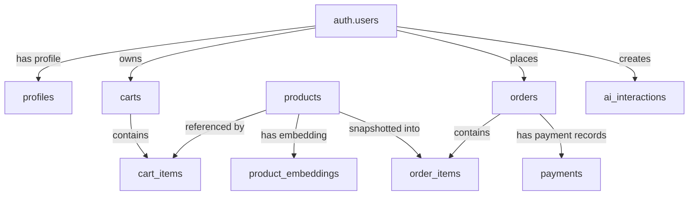

# Database Documentation

## Purpose

This document describes the database structure implemented in this repository.

It covers:

- database platform and access pattern
- migration files
- tables and relationships
- constraints and indexes
- row-level security policies
- semantic retrieval support
- how the application uses the schema

This document is based on the committed migration files and current backend data-access code:

- [backend/migrations/0001_initial_schema.sql](/D:/humayra/ai-enabled-ecommerce/backend/migrations/0001_initial_schema.sql)
- [backend/migrations/0002_checkout_schema_compatibility.sql](/D:/humayra/ai-enabled-ecommerce/backend/migrations/0002_checkout_schema_compatibility.sql)
- [backend/migrations/0003_semantic_retrieval.sql](/D:/humayra/ai-enabled-ecommerce/backend/migrations/0003_semantic_retrieval.sql)
- [backend/app/core/supabase_client.py](/D:/humayra/ai-enabled-ecommerce/backend/app/core/supabase_client.py)
- [backend/app/services/product_service.py](/D:/humayra/ai-enabled-ecommerce/backend/app/services/product_service.py)
- [backend/app/services/order_service.py](/D:/humayra/ai-enabled-ecommerce/backend/app/services/order_service.py)
- [backend/app/services/payment_service.py](/D:/humayra/ai-enabled-ecommerce/backend/app/services/payment_service.py)
- [backend/app/services/hybrid_search_service.py](/D:/humayra/ai-enabled-ecommerce/backend/app/services/hybrid_search_service.py)

## 1. Database Platform

The project uses Supabase as the primary data platform.

From the current backend code, Supabase is used for:

- PostgreSQL storage
- authentication through `auth.users`
- row-level security policies
- RPC execution for semantic retrieval

The backend creates a Supabase client in [backend/app/core/supabase_client.py](/D:/humayra/ai-enabled-ecommerce/backend/app/core/supabase_client.py) using:

- `SUPABASE_URL`
- `SUPABASE_SECRET_KEY` or `SUPABASE_SERVICE_ROLE_KEY`

The backend uses the service credential, which allows server-side access to protected tables and RPCs.

## 2. Migration Files

The committed database schema is defined through three SQL migration files.

### 2.1 `0001_initial_schema.sql`

This migration creates:

- extensions
- core tables
- indexes
- update triggers
- row-level security policies

Created extensions:

- `pgcrypto`
- `vector`

Created tables:

- `products`
- `product_embeddings`
- `profiles`
- `carts`
- `cart_items`
- `orders`
- `order_items`
- `payments`
- `ai_interactions`

### 2.2 `0002_checkout_schema_compatibility.sql`

This migration updates the checkout-related tables without dropping data.

It:

- adds `product_name`, `unit_price`, and `quantity` to `order_items`
- backfills `product_name` and `unit_price` from `products`
- keeps legacy `name` and `price` columns nullable for compatibility
- adds `currency` to `payments`

### 2.3 `0003_semantic_retrieval.sql`

This migration updates the semantic retrieval schema.

It:

- makes the older `embedding` column nullable
- adds `embedding_384 vector(384)` to `product_embeddings`
- creates an HNSW index on `embedding_384`
- creates the `match_products_hybrid(...)` SQL function
- grants execute access on that function

## 3. Schema Overview

The database serves four main areas:

1. product catalog storage
2. user and commerce data
3. payment state
4. AI and retrieval support

## 4. Entity Relationship Summary



## 5. Table Reference

## 5.1 `products`

The `products` table is the central catalog table.

### Purpose

Stores the normalized product catalog used by:

- the storefront
- product detail pages
- checkout repricing
- AI recommendations
- semantic retrieval

### Primary key

- `id text primary key`

### Important columns

| Column | Type | Notes |
| --- | --- | --- |
| `id` | `text` | primary identifier used throughout the app |
| `source_id` | `text` | optional external source identifier |
| `slug` | `text` | optional slug |
| `name` | `text` | required |
| `category` | `text` | required original category |
| `normalized_category` | `text` | normalized category used in filtering and retrieval |
| `product_type` | `text` | optional subtype |
| `brand` | `text` | optional |
| `price` | `numeric(12,2)` | required, non-negative |
| `old_price` | `numeric(12,2)` | optional, must be null or greater than/equal to `price` |
| `unit` | `text` | optional |
| `image_url` | `text` | optional |
| `product_url` | `text` | required and unique |
| `stock_status` | `text` | required, limited to `in_stock`, `out_of_stock`, or `unknown` |
| `tags` | `text[]` | default empty array |
| `scraped_at` | `timestamptz` | required |
| `created_at` | `timestamptz` | defaults to `now()` |
| `updated_at` | `timestamptz` | defaults to `now()` |

### Constraints

- `price >= 0`
- `old_price is null or old_price >= price`
- `stock_status` limited by check constraint
- `product_url` unique

### Indexes

- unique index on `source_id` when not null
- unique index on `slug` when not null
- index on `normalized_category`
- index on `price`
- GIN full-text index on `name`

### Application usage

This table is read by:

- `load_products()` in [backend/app/services/product_service.py](/D:/humayra/ai-enabled-ecommerce/backend/app/services/product_service.py)
- `get_product_by_id()` in the same service
- `create_pending_order()` in [backend/app/services/order_service.py](/D:/humayra/ai-enabled-ecommerce/backend/app/services/order_service.py)
- semantic retrieval queries through `match_products_hybrid(...)`

This table is written by:

- [backend/scripts/seed_products.py](/D:/humayra/ai-enabled-ecommerce/backend/scripts/seed_products.py)

## 5.2 `product_embeddings`

The `product_embeddings` table stores vector representations of products.

### Purpose

Supports semantic retrieval across the product catalog.

### Primary key

- `product_id text primary key`

### Relationship

- `product_id` references `products(id)` with `on delete cascade`

### Important columns

| Column | Type | Notes |
| --- | --- | --- |
| `product_id` | `text` | one-to-one with `products` |
| `content_hash` | `text` | used to track whether a product document changed |
| `model` | `text` | embedding model name |
| `embedding` | `vector(1536)` | older embedding column kept for compatibility |
| `embedding_384` | `vector(384)` | current retrieval column added in migration `0003` |
| `created_at` | `timestamptz` | defaults to `now()` |
| `updated_at` | `timestamptz` | defaults to `now()` |

### Indexes

- HNSW index on `embedding_384` using cosine distance

### Application usage

This table is written by:

- [backend/scripts/generate_product_embeddings.py](/D:/humayra/ai-enabled-ecommerce/backend/scripts/generate_product_embeddings.py)

This table is read by:

- the SQL function `match_products_hybrid(...)`
- [backend/app/services/hybrid_search_service.py](/D:/humayra/ai-enabled-ecommerce/backend/app/services/hybrid_search_service.py) through Supabase RPC

## 5.3 `profiles`

The `profiles` table stores application profile data associated with Supabase Auth users.

### Purpose

Holds optional user profile fields separate from the Supabase auth system.

### Primary key

- `id uuid primary key`

### Relationship

- `id` references `auth.users(id)` with `on delete cascade`

### Important columns

| Column | Type | Notes |
| --- | --- | --- |
| `id` | `uuid` | same value as Supabase auth user ID |
| `email` | `text` | optional |
| `full_name` | `text` | optional |
| `created_at` | `timestamptz` | defaults to `now()` |
| `updated_at` | `timestamptz` | defaults to `now()` |

### Application usage

The table exists in the schema and has RLS policies, but the currently reviewed backend and frontend code do not show a full profile management flow through dedicated API routes.

## 5.4 `carts`

The `carts` table stores persistent carts for authenticated users.

### Purpose

Represents server-side cart ownership and cart lifecycle states.

### Primary key

- `id uuid primary key default gen_random_uuid()`

### Relationship

- `user_id` references `auth.users(id)` with `on delete cascade`

### Important columns

| Column | Type | Notes |
| --- | --- | --- |
| `id` | `uuid` | cart ID |
| `user_id` | `uuid` | owner of the cart |
| `status` | `text` | `active`, `converted`, or `abandoned` |
| `created_at` | `timestamptz` | defaults to `now()` |
| `updated_at` | `timestamptz` | defaults to `now()` |

### Constraints

- unique `(user_id, status)`

### Application usage

The schema supports persistent carts, but the current frontend cart implementation uses browser local storage in `CartProvider` rather than these tables.

## 5.5 `cart_items`

The `cart_items` table stores line items for persistent carts.

### Purpose

Stores product references and quantities for the server-side cart model.

### Primary key

- `id uuid primary key default gen_random_uuid()`

### Relationships

- `cart_id` references `carts(id)` with `on delete cascade`
- `product_id` references `products(id)`

### Important columns

| Column | Type | Notes |
| --- | --- | --- |
| `id` | `uuid` | line item ID |
| `cart_id` | `uuid` | parent cart |
| `product_id` | `text` | referenced product |
| `quantity` | `integer` | must be between 1 and 99 |
| `created_at` | `timestamptz` | defaults to `now()` |
| `updated_at` | `timestamptz` | defaults to `now()` |

### Constraints

- `quantity > 0 and quantity <= 99`
- unique `(cart_id, product_id)`

### Application usage

The table is defined and protected by RLS, but it is not part of the current frontend checkout path.

## 5.6 `orders`

The `orders` table stores checkout-level records.

### Purpose

Represents a submitted checkout request and its lifecycle through payment.

### Primary key

- `id uuid primary key default gen_random_uuid()`

### Relationship

- `user_id` references `auth.users(id)` with `on delete restrict`

### Important columns

| Column | Type | Notes |
| --- | --- | --- |
| `id` | `uuid` | order ID |
| `user_id` | `uuid` | order owner |
| `customer_name` | `text` | delivery/contact name |
| `customer_phone` | `text` | phone number |
| `customer_address` | `text` | delivery address |
| `subtotal` | `numeric(12,2)` | item subtotal |
| `delivery_fee` | `numeric(12,2)` | defaults to `0` |
| `total` | `numeric(12,2)` | order total |
| `currency` | `text` | defaults to `BDT` |
| `status` | `text` | current order status |
| `idempotency_key` | `uuid` | unique request key |
| `created_at` | `timestamptz` | defaults to `now()` |
| `updated_at` | `timestamptz` | defaults to `now()` |

### Status constraint

Allowed order statuses:

- `pending_payment`
- `paid`
- `confirmed`
- `cancelled`
- `refunded`
- `payment_failed`

### Indexes

- unique index on `idempotency_key`
- index on `(user_id, created_at desc)`

### Application usage

This table is written by:

- `create_pending_order()` in [backend/app/services/order_service.py](/D:/humayra/ai-enabled-ecommerce/backend/app/services/order_service.py)

This table is read by:

- `load_orders_for_user()`
- `get_order_for_user()`

This table is updated by:

- payment verification logic in [backend/app/services/payment_service.py](/D:/humayra/ai-enabled-ecommerce/backend/app/services/payment_service.py)

## 5.7 `order_items`

The `order_items` table stores immutable order line items.

### Purpose

Stores product snapshots at the time of checkout rather than relying only on future reads from `products`.

### Primary key

- `id uuid primary key default gen_random_uuid()`

### Relationships

- `order_id` references `orders(id)` with `on delete cascade`
- `product_id` references `products(id)`

### Important columns

| Column | Type | Notes |
| --- | --- | --- |
| `id` | `uuid` | line item ID |
| `order_id` | `uuid` | parent order |
| `product_id` | `text` | product reference |
| `product_name` | `text` | snapshot of product name |
| `unit_price` | `numeric(12,2)` | snapshot of unit price |
| `quantity` | `integer` | must be between 1 and 99 |
| `created_at` | `timestamptz` | defaults to `now()` |

Legacy compatibility columns retained by migration `0002`:

- `name`
- `price`

### Constraints

- `unit_price >= 0`
- `quantity > 0 and quantity <= 99`

### Indexes

- index on `order_id`

### Application usage

Written during checkout by `create_pending_order()`.

This table allows order history to show the product name and price that were used when the order was created.

## 5.8 `payments`

The `payments` table stores payment provider state for each order.

### Purpose

Tracks the payment lifecycle separately from the order record.

### Primary key

- `id uuid primary key default gen_random_uuid()`

### Relationship

- `order_id` references `orders(id)` with `on delete restrict`

### Important columns

| Column | Type | Notes |
| --- | --- | --- |
| `id` | `uuid` | payment row ID |
| `order_id` | `uuid` | related order |
| `provider` | `text` | payment provider name |
| `provider_payment_id` | `text` | provider transaction reference |
| `status` | `text` | payment state |
| `amount` | `numeric(12,2)` | payment amount |
| `currency` | `text` | defaults to `BDT` |
| `provider_event_id` | `text` | verification or event reference |
| `created_at` | `timestamptz` | defaults to `now()` |
| `updated_at` | `timestamptz` | defaults to `now()` |

### Status constraint

Allowed payment statuses:

- `created`
- `requires_payment`
- `succeeded`
- `failed`
- `cancelled`
- `refunded`

### Indexes

- index on `order_id`
- unique `provider_payment_id`
- unique `provider_event_id`

### Application usage

This table is:

- initialized during checkout
- updated when the payment session is created
- updated again after success, failure, or cancellation callbacks

Current payment logic is implemented in:

- `start_sslcommerz_payment()`
- `verify_sslcommerz_payment()`
- `mark_payment_unsuccessful()`

## 5.9 `ai_interactions`

The `ai_interactions` table stores metadata about AI activity.

### Purpose

Provides a place to record:

- which AI feature was used
- request metadata
- response metadata
- model information
- latency

### Primary key

- `id uuid primary key default gen_random_uuid()`

### Relationship

- `user_id` references `auth.users(id)` with `on delete set null`

### Important columns

| Column | Type | Notes |
| --- | --- | --- |
| `id` | `uuid` | interaction ID |
| `user_id` | `uuid` | optional user reference |
| `feature` | `text` | feature name |
| `request_metadata` | `jsonb` | defaults to empty JSON object |
| `response_metadata` | `jsonb` | defaults to empty JSON object |
| `model` | `text` | optional model name |
| `latency_ms` | `integer` | must be null or non-negative |
| `created_at` | `timestamptz` | defaults to `now()` |

### Indexes

- index on `(user_id, created_at desc)`

### Application usage

The table is created in the schema and protected by RLS. The currently reviewed codebase does not show a complete repository-wide write path for all AI endpoints into this table.

## 6. Update Triggers

The schema defines a shared trigger function:

- `public.set_updated_at()`

This function sets `updated_at = now()` before update.

Triggers are created for:

- `products`
- `profiles`
- `carts`
- `cart_items`
- `orders`
- `payments`

`order_items` and `ai_interactions` do not have `updated_at` columns in the committed schema, so they do not use this trigger.

## 7. Row-Level Security

Row-level security is enabled on:

- `products`
- `product_embeddings`
- `profiles`
- `carts`
- `cart_items`
- `orders`
- `order_items`
- `payments`
- `ai_interactions`

## 7.1 Product Access

Policy:

- `public can read products`

Effect:

- any user can select from `products`

This matches the public product browsing flow in the frontend and backend.

## 7.2 Profile Access

Policies:

- users can read own profile
- users can update own profile

Effect:

- a user can only read or update the `profiles` row whose `id` matches `auth.uid()`

## 7.3 Cart Access

Policies:

- users can read own carts
- users can manage own carts
- users can manage own cart items

Effect:

- a user can only access carts where `user_id = auth.uid()`
- cart items are accessible only if their parent cart belongs to the same authenticated user

## 7.4 Order and Payment Access

Policies:

- users can read own orders
- users can read own order items
- users can read own payments

Effect:

- order records are visible only to the owning user
- order items are visible only when their parent order belongs to the same user
- payments are visible only through ownership of the related order

## 7.5 AI Interaction Access

Policy:

- users can read own ai interactions

Effect:

- a user can only read AI interaction records where `user_id = auth.uid()`

## 8. Semantic Retrieval Support

Semantic retrieval is implemented through both schema and SQL function logic.

## 8.1 Vector Storage

The database uses the `vector` extension.

Current vector support includes:

- legacy `embedding vector(1536)`
- current `embedding_384 vector(384)`

The current backend embedding service uses:

- model name: `sentence-transformers/all-MiniLM-L6-v2`
- 384-dimensional embeddings

## 8.2 Retrieval Index

Migration `0003` creates:

- `product_embeddings_embedding_384_hnsw_idx`

This is an HNSW index using cosine distance:

```sql
using hnsw (embedding_384 vector_cosine_ops)
```

## 8.3 Retrieval Function

The SQL function `match_products_hybrid(...)` returns:

- product ID and product metadata
- a fixed `reason` string
- a `semantic_score`

It supports:

- query embedding input
- optional category filtering
- optional minimum price filtering
- optional maximum price filtering
- bounded result count between 1 and 20

The function is granted to:

- `anon`
- `authenticated`
- `service_role`

## 9. Data Flow Through the Database

## 9.1 Catalog Load Flow

1. `seed_products.py` reads `data/processed/products.json`
2. the script upserts rows into `products`
3. backend product APIs read from `products`
4. if that read fails, the backend can fall back to local JSON

## 9.2 Embedding Index Flow

1. `generate_product_embeddings.py` reads processed products
2. products are enriched with tags and normalized fields
3. an embedding document is built for each product
4. embeddings are generated in batches
5. embeddings are upserted into `product_embeddings`
6. `/api/search/hybrid` reads from the retrieval RPC built on these rows

## 9.3 Checkout Flow

1. frontend sends checkout input to `/api/orders/checkout`
2. backend verifies the authenticated user
3. backend reads current product prices from `products`
4. backend inserts an `orders` row
5. backend inserts `order_items`
6. backend inserts a `payments` row
7. payment callbacks update `payments` and `orders`

## 10. Current Database Usage Gaps

The schema is broader than the currently exercised runtime path.

The following gaps are visible from the current code:

- `carts` and `cart_items` exist, but the active frontend cart uses local storage instead of database persistence
- `profiles` exists, but the reviewed code does not show a full profile management flow
- `ai_interactions` exists, but a complete logging path for every AI feature is not visible in the reviewed API code
- `products` has a text-search index on `name`, but the current public product list route uses in-memory filtering after loading products rather than a database query with pagination

## 11. Summary

The database design is centered on a Supabase PostgreSQL schema with:

- a normalized product catalog
- checkout and payment tables
- row-level security for user-owned data
- vector storage for semantic product retrieval
- compatibility updates for the evolving checkout model

The most active tables in the current application flow are:

- `products`
- `product_embeddings`
- `orders`
- `order_items`
- `payments`

The schema also includes support for:

- server-side carts
- user profiles
- AI interaction logging

Those parts are present in the database design even where the current frontend and API flow does not yet use them fully.
