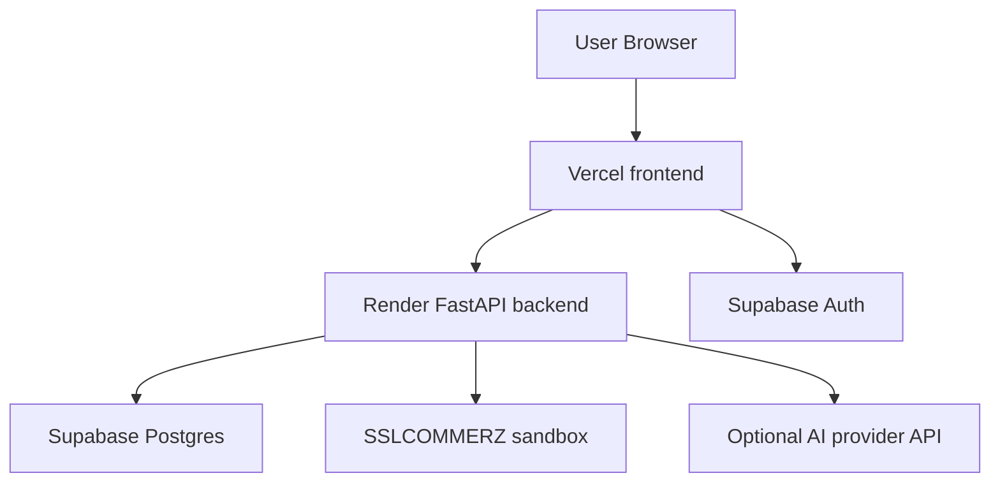

# Deployment

## Purpose

This document describes the deployment setup represented in the repository.

It covers:

- the currently deployed application URLs
- the deployed service split
- the committed deployment configuration
- required environment variables
- deployment steps supported by the current repository
- current deployment limitations visible in the codebase

This document is based on:

- [render.yaml](/D:/humayra/ai-enabled-ecommerce/render.yaml)
- [.env.example](/D:/humayra/ai-enabled-ecommerce/.env.example)
- [backend/app/core/settings.py](/D:/humayra/ai-enabled-ecommerce/backend/app/core/settings.py)
- [frontend/src/lib/api.ts](/D:/humayra/ai-enabled-ecommerce/frontend/src/lib/api.ts)
- [frontend/src/lib/supabase/client.ts](/D:/humayra/ai-enabled-ecommerce/frontend/src/lib/supabase/client.ts)
- [frontend/next.config.ts](/D:/humayra/ai-enabled-ecommerce/frontend/next.config.ts)

## 1. Live Deployment URLs

The project currently uses the following live URLs:

- Frontend: [https://ai-enabled-ecommerce.vercel.app](https://ai-enabled-ecommerce.vercel.app)
- Backend API: [https://ai-grocery-commerce-api.onrender.com](https://ai-grocery-commerce-api.onrender.com)
- Backend health: [https://ai-grocery-commerce-api.onrender.com/api/health](https://ai-grocery-commerce-api.onrender.com/api/health)

## 2. Deployment Topology

The current deployed system is split across three main services:

1. frontend on Vercel
2. backend on Render
3. database and authentication on Supabase

The payment flow also depends on:

4. SSLCOMMERZ sandbox endpoints

The current deployment shape is:



## 3. Frontend Deployment

## 3.1 Current frontend host

The live frontend is:

- [https://ai-enabled-ecommerce.vercel.app](https://ai-enabled-ecommerce.vercel.app)

The repository does not include a committed `vercel.json` file. The current frontend structure is still consistent with a standard Vercel deployment because:

- it is a Next.js application
- environment variables are read using `process.env`
- no custom Node server is required

## 3.2 Frontend runtime behavior that affects deployment

The frontend depends on:

- `NEXT_PUBLIC_API_BASE_URL`
- `NEXT_PUBLIC_SUPABASE_URL`
- `NEXT_PUBLIC_SUPABASE_PUBLISHABLE_KEY`

These are used in:

- [frontend/src/lib/api.ts](/D:/humayra/ai-enabled-ecommerce/frontend/src/lib/api.ts)
- [frontend/src/lib/supabase/client.ts](/D:/humayra/ai-enabled-ecommerce/frontend/src/lib/supabase/client.ts)

This means the frontend deployment must be configured with public environment variables that point to:

- the deployed backend API
- the Supabase project

## 3.3 Image handling in deployment

The Next.js image configuration is defined in:

- [frontend/next.config.ts](/D:/humayra/ai-enabled-ecommerce/frontend/next.config.ts)

Current settings:

- `images.unoptimized = true`
- remote pattern allowed for `d2t8nl1y0ie1km.cloudfront.net`

This is relevant for deployment because the scraped product catalog uses remote CloudFront image assets. The current frontend does not depend on Next.js server-side image optimization reaching that host.

## 3.4 Frontend build assumptions

The current repository structure supports the usual Next.js deployment flow:

```bash
cd frontend
npm install
npm run build
```

The committed `package.json` defines:

- `dev`
- `build`
- `start`
- `lint`

## 4. Backend Deployment

## 4.1 Current backend host

The live backend is:

- [https://ai-grocery-commerce-api.onrender.com](https://ai-grocery-commerce-api.onrender.com)

The health endpoint is:

- [https://ai-grocery-commerce-api.onrender.com/api/health](https://ai-grocery-commerce-api.onrender.com/api/health)

## 4.2 Committed Render configuration

The repository contains a committed Render deployment file:

- [render.yaml](/D:/humayra/ai-enabled-ecommerce/render.yaml)

The current configuration defines one web service with:

- `type: web`
- `name: ai-grocery-commerce-api`
- `runtime: python`
- `plan: free`
- `rootDir: backend`
- `buildCommand: pip install -r requirements.txt`
- `startCommand: uvicorn app.main:app --host 0.0.0.0 --port $PORT`
- `healthCheckPath: /api/health`

## 4.3 Backend deployment behavior

From the current code, the backend:

- starts with Uvicorn
- exposes the FastAPI app from `app.main:app`
- reads configuration from environment variables
- uses Supabase for data access and auth validation
- may call an AI provider and the SSLCOMMERZ API at runtime

## 4.4 Backend environment settings in code

Backend settings are defined in:

- [backend/app/core/settings.py](/D:/humayra/ai-enabled-ecommerce/backend/app/core/settings.py)

The main runtime variables used by the backend are:

- `SUPABASE_URL`
- `SUPABASE_SECRET_KEY` or `SUPABASE_SERVICE_ROLE_KEY`
- `AI_PROVIDER`
- `OPENAI_API_KEY`
- `OPENAI_BASE_URL`
- `OPENAI_CHAT_MODEL`
- `OPENAI_EMBEDDING_MODEL`
- `GROQ_API_KEY`
- `GROQ_BASE_URL`
- `GROQ_CHAT_MODEL`
- `XAI_API_KEY`
- `XAI_BASE_URL`
- `XAI_CHAT_MODEL`
- `AI_AGENT_ENABLED`
- `AI_AGENT_MAX_TOOL_CALLS`
- `AI_HEALTH_DISCLAIMER_ENABLED`
- `FRONTEND_URL`
- `BACKEND_URL`
- `CORS_ALLOWED_ORIGINS`
- `SSLCOMMERZ_STORE_ID`
- `SSLCOMMERZ_STORE_PASSWORD`
- `SSLCOMMERZ_SANDBOX`

## 4.5 Variables defined in `render.yaml`

The committed Render file sets or expects:

- `AI_PROVIDER=groq`
- `AI_AGENT_ENABLED=true`
- `AI_HEALTH_DISCLAIMER_ENABLED=true`
- `GROQ_BASE_URL=https://api.groq.com/openai/v1`
- `GROQ_CHAT_MODEL=llama-3.1-8b-instant`
- `SSLCOMMERZ_SANDBOX=true`

The following are marked `sync: false` and therefore must be provided in the Render environment:

- `SUPABASE_URL`
- `SUPABASE_SERVICE_ROLE_KEY`
- `GROQ_API_KEY`
- `FRONTEND_URL`
- `BACKEND_URL`
- `CORS_ALLOWED_ORIGINS`
- `SSLCOMMERZ_STORE_ID`
- `SSLCOMMERZ_STORE_PASSWORD`

## 5. Supabase Deployment Role

Supabase is not deployed from this repository, but it is a required external platform for the deployed application.

Supabase provides:

- PostgreSQL database
- `auth.users` identity store
- bearer token validation support through the backend

For deployment, Supabase must already have:

- the schema applied from `backend/migrations/`
- seeded product data
- any required embedding rows for semantic search
- the correct auth configuration for the frontend domain

## 6. Payment Deployment Role

The backend payment integration is implemented for SSLCOMMERZ and expects:

- backend callback URLs
- sandbox or live credentials

Current deployment assumptions visible in code:

- callback URLs are based on `BACKEND_URL`
- result redirects are based on `FRONTEND_URL`
- sandbox mode is controlled by `SSLCOMMERZ_SANDBOX`

This means the deployed environment must set `FRONTEND_URL` and `BACKEND_URL` correctly so the payment flow can redirect to the right domains.

## 7. Environment Variables

The repository includes a master environment template:

- [.env.example](/D:/humayra/ai-enabled-ecommerce/.env.example)

## 7.1 Shared variables

The following variables appear in the repository-level template:

| Variable | Used by | Purpose |
| --- | --- | --- |
| `SUPABASE_URL` | backend | Supabase project URL |
| `SUPABASE_ANON_KEY` | reference/shared config | anon key reference |
| `SUPABASE_SERVICE_ROLE_KEY` | backend | service-level Supabase access |
| `DATABASE_URL` | template only in current repo | reserved for direct DB access if needed |
| `FRONTEND_URL` | backend | used for redirects and CORS defaults |
| `BACKEND_URL` | backend | used for payment callback construction |
| `CORS_ALLOWED_ORIGINS` | backend | allowed frontend origins |

## 7.2 AI variables

| Variable | Used by | Purpose |
| --- | --- | --- |
| `AI_PROVIDER` | backend | active provider selection |
| `OPENAI_API_KEY` | backend | OpenAI access |
| `OPENAI_BASE_URL` | backend | OpenAI-compatible base URL |
| `OPENAI_CHAT_MODEL` | backend | OpenAI chat model |
| `OPENAI_EMBEDDING_MODEL` | backend | embedding model setting |
| `GROQ_API_KEY` | backend | Groq access |
| `GROQ_BASE_URL` | backend | Groq OpenAI-compatible base URL |
| `GROQ_CHAT_MODEL` | backend | Groq chat model |
| `XAI_API_KEY` | backend | xAI access |
| `XAI_BASE_URL` | backend | xAI base URL |
| `XAI_CHAT_MODEL` | backend | xAI model |
| `AI_AGENT_ENABLED` | backend | enables provider-assisted chat synthesis |
| `AI_AGENT_MAX_TOOL_CALLS` | backend | max tool call setting |
| `AI_HEALTH_DISCLAIMER_ENABLED` | backend | toggles health disclaimer behavior |

## 7.3 Payment variables

| Variable | Used by | Purpose |
| --- | --- | --- |
| `SSLCOMMERZ_STORE_ID` | backend | payment gateway identity |
| `SSLCOMMERZ_STORE_PASSWORD` | backend | payment gateway credential |
| `SSLCOMMERZ_SANDBOX` | backend | sandbox/live mode switch |

## 7.4 Frontend public variables

| Variable | Used by | Purpose |
| --- | --- | --- |
| `NEXT_PUBLIC_API_BASE_URL` | frontend | backend base URL |
| `NEXT_PUBLIC_SUPABASE_URL` | frontend | Supabase project URL |
| `NEXT_PUBLIC_SUPABASE_PUBLISHABLE_KEY` | frontend | public Supabase key |

## 8. Deployment Sequence

The current repository supports the following practical deployment sequence.

## 8.1 Prepare Supabase

1. create or configure the Supabase project
2. apply SQL migrations from `backend/migrations/`
3. seed `products`
4. generate and store `product_embeddings` if semantic search is required
5. confirm auth settings and redirect URLs

## 8.2 Deploy backend to Render

1. connect the repository to Render
2. use the committed `render.yaml`
3. configure the required secret environment variables
4. deploy the `backend/` service
5. verify `/api/health`

## 8.3 Deploy frontend to Vercel

1. connect the repository to Vercel
2. set the project root to `frontend/` if needed
3. configure the public environment variables
4. deploy the Next.js application
5. verify that the frontend can reach the deployed backend

## 8.4 Verify cross-service configuration

After both services are live, verify:

- frontend API calls point to the Render backend
- frontend Supabase auth uses the correct project
- backend CORS allows the Vercel frontend origin
- backend payment callbacks use the correct public backend URL
- frontend checkout result page can receive payment redirects

## 9. Post-Deployment Checks

The repository provides enough information to perform the following checks after deployment.

## 9.1 Backend checks

- open `/api/health`
- open `/docs`
- call `/api/products`
- call `/api/search/hybrid` if embeddings are loaded
- call `/api/ai/provider-status`

## 9.2 Frontend checks

- open the home page
- confirm catalog products load
- confirm remote images render
- test Supabase sign-up or sign-in
- test order history loading after authentication

## 9.3 Checkout checks

- add products to the cart
- start checkout
- confirm the backend returns a payment URL
- verify redirect behavior through the SSLCOMMERZ sandbox flow

## 10. What Is Committed Versus What Is External

The repository currently commits:

- backend deployment manifest for Render
- environment variable template
- backend and frontend code that read deployment settings
- live URLs referenced in the documentation

The repository does not currently commit:

- a Vercel-specific deployment config file
- a Supabase project export
- secret environment values
- an automated deployment workflow

## 11. Current Deployment Limitations

The following limits are visible from the current repository state.

### 11.1 Backend deployment is explicitly documented in code, frontend deployment is inferred

The backend has a committed `render.yaml`, but the frontend does not have a committed `vercel.json` or other platform-specific deployment manifest.

### 11.2 Search depends on external index readiness

Semantic search requires:

- migrated vector schema
- generated embeddings
- available Supabase RPC function

If those are not present, the frontend falls back to browser-side semantic matching.

### 11.3 Payment depends on correct public URL settings

The payment flow depends on:

- `BACKEND_URL`
- `FRONTEND_URL`

Incorrect values will break callback or redirect behavior.

### 11.4 The repo does not include infrastructure automation beyond Render service definition

There is no committed Terraform, Pulumi, Docker Compose production stack, or GitHub Actions deployment workflow in the current repository.

### 11.5 Runtime dependencies remain external

Production behavior still depends on external services being configured correctly:

- Supabase
- Render
- Vercel
- SSLCOMMERZ
- optional AI provider APIs

## 12. Summary

The current deployment model is a managed-service setup:

- Vercel for the Next.js frontend
- Render for the FastAPI backend
- Supabase for the database and authentication layer
- SSLCOMMERZ sandbox for payment flow testing

The most explicit committed deployment artifact is `render.yaml` for the backend. The frontend deployment is supported by the repository structure and environment variable usage, but it is not described by a platform-specific config file in the repo. The deployment is therefore functional and understandable, but still lightweight rather than fully infrastructure-automated.

